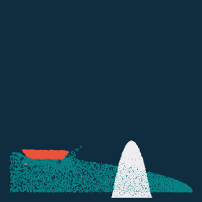

# 太极图形课S1-大作业 188行代码的《泰坦尼克号》+《打砖块游戏：少林足球版》

## 作业来源
所谓来源，是一件可近可远的事情。

从近，是其躯体，是流体小作业的改进，是基于Taichi自带示例的mpm，其丝滑仿若高山流水。从远，是其灵魂，是某篇[“99行代码的《冰雪奇缘》”](https://zhuanlan.zhihu.com/p/97700605)，其配图让人食欲大开。

那时，当我第一次点开这段“冰雪奇缘”的视频，我看见了三块真空中栩栩如生的方块。于是，我以为我大概似乎也许的确是被“骗”进来了。

而这一“骗”，便从金秋到了寒冬。

在这段时间里，我每天添一点知识，终于在这最后领会到了这寥寥数行后所包裹的精妙与恢弘，正像简若黑白又裹挟一切的太极。

而今，这一切又似乎即将回归来时的沉寂，仿佛随处可见的数值耗散，将一切殆尽。为了让这个故事从指数衰减的趋势重回太极般循环的螺旋，这次或许轮到我，来尝试把下一个人也“骗”进来。

这大抵就是这个作业——188行代码的《泰坦尼克号》——的来源。

另外随电影附赠小游戏一枚——《打砖块游戏：少林足球版》，其灵感依旧是渊鸣老师大作，致敬其[软体俄罗斯方块](https://zhuanlan.zhihu.com/p/422931456)。能和俄罗斯方块旗鼓相当的，大约打砖块游戏也算一个吧。


## 运行方式
#### 运行环境：
`[Taichi] version 0.8.5, llvm 10.0.0, commit 45c6ad48, win, python 3.9.1`

#### 运行方式：
看电影《泰坦尼克号》：

python Titanic188.py

玩游戏《打砖块游戏：少林足球版》：

python pong.py


## 效果展示
#### 文字描述+动图展示：

电影《泰坦尼克号》：

1912年4月14日，星期天晚上，号称“永不沉没的”泰坦尼克号飞驰在它生命中最后的一个夜晚，驶向波涛汹涌中的死亡冰山……

（免责声明：危险动作，请勿模仿；本电影录制中，没有任何人员或动物受到伤害）




游戏《打砖块游戏：少林足球版》：

一款不经典的打砖块游戏，画面不清晰玩法不简单，WASD控制。

在这里，挡板来自少林世家，具备水上漂、无影脚等武学造诣，根据不同出招对砖块造成不同的伤害效果。目前为alpha版，难以控制、容易爆炸，低血压患者的福音。


## 整体结构
```
-LICENSE
-|data
-README.MD
-Titanic188.py
-pong.py
```


## 实现细节

### 主要效果
基于Taichi自带示例的mpm法，补充实现了下列效果：

令人惊叹的电影特效：
1. 船，具有“水能载舟、亦能覆舟”的特性。载舟的实现方式，是通过统计其附近网格的水的总质量（因为浮力等于被排挤的水的重量）；覆舟的实现方式，是通过判断局部的水是否处于该局部船的上方。为了实现这一目标，目前将原来的网格按物质进行了拆分（或许有更省资源的方法？）。
2. 冰山，一座冰的山状物，其实是“冰雪奇缘”的雪被爱莎施加了变硬魔法后得到。
3. 爆炸物，把塑形形变中的箝位值设得更严格一些（尤其是压缩的塑形阈值），就能实现偶然的爆炸效果。其实或许是真爆炸——“数值爆炸”。这在别的代码里可能是bug，但请牢记，这在本剧组里是为了实现游轮漏油爆炸的戏剧效果而留下的“特性”。


别具一格的游戏机制：
1. 灵活走位的挡板，其实现本质是调整了参数的船。
2. 具有不同力度的出招，效果类似少林足球。平时轻弹，对砖块造成挠痒痒效果；也可急停翘起临门一脚，一击毙命。其实现是通过网格进行适当参数的动量交换，造成数值爆炸。
3. 治疗低血压的砖块。让塑形物体悬浮于空中，正常一次只能掉一点点，令人血压上升（致敬软体俄罗斯方块）。


### 整体流程

1. 起。创建船、水、冰山，并将其放置于具有视觉张力的非平衡初态。
2. 承。让船在水面拍打、疾驰，溅起水花，撞向冰山。每一dt，都是动量于网格的暗中交易，都是浮力和重力从中作梗。
3. 转。爆炸，到处爆炸，不可预料（包括作者与上帝）的却恰到好处的爆炸。
4. 合。沉船，船因塑形变形失去了棱角，因爆炸折断了身躯，最终缓缓沉没于冷酷的冰山脚下。

噢，对了，忘了说，在本次观影过程中，你可以用WSAD来尝试拯救泰坦尼克号。当然，冰冷无情的大海可不是那么容易战胜的，你能做到吗？想尝试的话，请再买下一场的电影票吧（请勿在买票前按R键）。

感谢观看！

